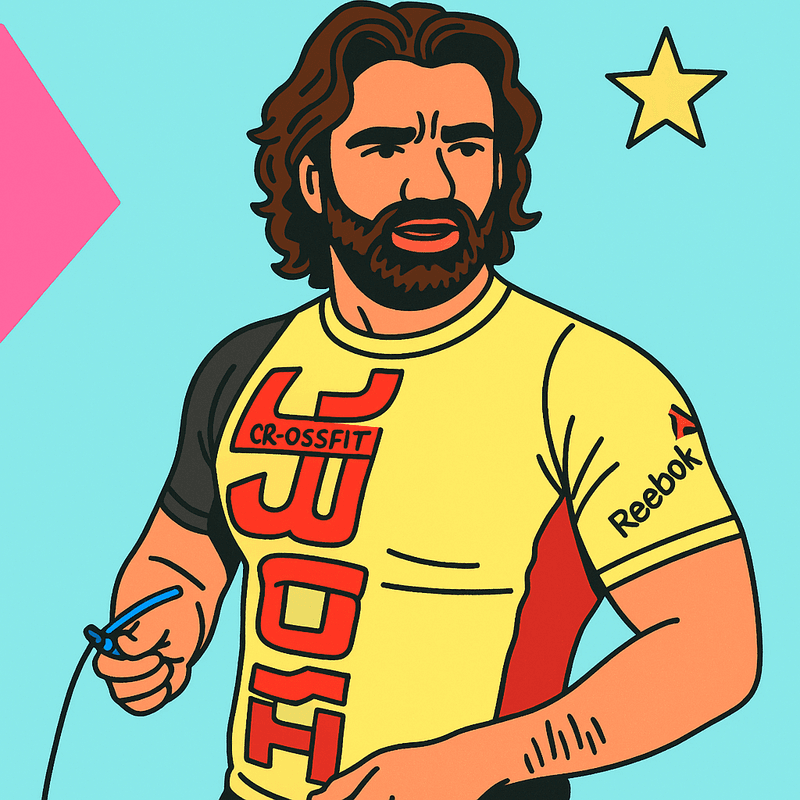

# 🌊 BE WATER | Centro de Treino & Filosofia Bruce Lee

<div align="center">


**Flow Like Water, Strike Like Lightning** ⚡

[](https://bewaterlisboa.pt)
[](https://pagamentos.bewaterlisboa.pt)
[](#)

*Centro de treino inspirado na filosofia de Bruce Lee, combinando preparação física, artes marciais e desenvolvimento pessoal em Lisboa.*

</div>

---

## 🎯 **Sobre o Projeto**

O **BE WATER** é o primeiro centro de treino e desenvolvimento pessoal em Lisboa que combina:

- 🥋 **Treino Funcional Híbrido** - Força, condicionamento, agilidade e mobilidade
- 🥊 **Artes Marciais & Wellness** - Boxe, Jiu-Jitsu, defesa pessoal 
- 🧠 **Desenvolvimento Pessoal** - Workshops, palestras e experiências únicas
- ⚡ **Easter Eggs** - Modalidades surpresa e eventos especiais

### 📍 **Localização**
**Av. do Brasil 7, 1700-062 Lisboa** | Abertura: **14 Julho 2025**

---

## ✨ **Funcionalidades do Website**

### 🎨 **Design & Experiência**
- **🌊 Design Bruce Lee Inspired** - Estética fluida como água com elementos neobrutais
- **⚡ Animações Dinâmicas** - Efeitos de água, transições suaves e micro-interações  
- **📱 100% Responsivo** - Experiência otimizada para todos os dispositivos
- **🌍 Sistema PT/EN** - Tradução completa português/inglês
- **♿ Acessibilidade** - Navegação por teclado, semântica HTML e ARIA

### 💡 **Funcionalidades Principais**

#### 🏠 **Website Principal** ([bewaterlisboa.pt](https://bewaterlisboa.pt))
- **⏰ Countdown Timer** - Contagem regressiva para abertura
- **🏋️ Planos de Preços** - 3 modalidades (Starter, Rise, Elite) com modais interativos
- **👨‍🏫 Equipa de Treinadores** - Apresentação da equipa especializada
- **📅 Horários Dinâmicos** - Grelha interativa de modalidades
- **📷 Galeria Gym** - Slider com fotos do espaço
- **📱 Formulários de Contacto** - Integração Formspree para mensagens

#### 💳 **Sistema de Pagamentos** ([pagamentos.bewaterlisboa.pt](https://pagamentos.bewaterlisboa.pt))
- **🛒 12 Produtos Disponíveis** - Café, água, batidos, equipamentos, donativos
- **📱 Pagamento MBWay** - Integração completa com EuPago API
- **🧾 Faturação Automática** - Emissão de faturas em PDF
- **📧 Sistema Flexível** - Campos opcionais para invoice (email, nome, NIF)
- **🌍 Tradução PT/EN** - Interface bilingue completa
- **⚡ Validação Inteligente** - Campos condicionais conforme necessidades

---

## 👨‍💼 **Fundador & Equipa**

<div align="center">

### **Bruno Salgueiro** - *Fundador & Head Coach*



**📺 Duplo Profissional** de TV & Cinema (16 anos) | **🏋️ Personal Trainer** Certificado desde 2012  
**🎬 Criador "Dicas do Salgueiro"** - 400K+ seguidores YouTube | 49M+ visualizações

[](https://youtube.com/@dicasdosalgueiro)
[](https://instagram.com/dicasdosalgueiro)
[](https://facebook.com/asdicasdosalgueiro)

</div>

### 🥇 **Equipa de Elite**
- **Jorge Segurado** - Ex-seleção nacional Rugby, Preparador Físico  
- **Luís Catarino** - Performance Coach SL Benfica, Mestrado Biocinética
- **Inês Pires** - S&C Coach SL Benfica, Doutoranda Educação Física
- **Joaquim Coelho** - Fisioterapeuta & Strength Specialist

---

## 🛠 **Stack Técnico**

### **Frontend**


### **Backend & Integrações**


### **Pagamentos & APIs**
- **💳 EuPago API** - Processamento MBWay
- **🧾 Invoicing** - Geração automática PDF  
- **📧 Formspree** - Processamento formulários
- **🗺️ Google Maps** - Integração mapas

### **Performance**
- **🚀 Lighthouse Score**: 95+ em todas as métricas
- **📱 Core Web Vitals**: Optimized
- **♿ Accessibility**: AA compliant

---

## 📁 **Estrutura do Projeto**

```
brutal-gym/
├── 🏠 index.html                     # Website principal  
├── 💳 pagamentos/                    # Sistema de pagamentos
│   ├── index.html                   # Interface de pagamento
│   ├── api/i18n.js                 # Traduções PT/EN  
│   └── netlify/functions/           # Backend Functions
│       ├── mbway-payment.js        # Processamento MBWay
│       ├── emit-invoice.js         # Geração faturas
│       └── payment-webhook.js      # Webhooks pagamento
├── 🎨 src/
│   ├── css/                        # Estilos
│   │   ├── styles.css             # CSS principal
│   │   └── regyfit.css            # Estilos Regy integration
│   ├── js/                        # JavaScript
│   │   ├── main.js               # Funcionalidades principais
│   │   ├── i18n.js              # Sistema tradução website
│   │   ├── modals.js            # Sistema modais
│   │   └── countdown.js         # Timer abertura
│   └── 📷 images/               # Assets visuais
│       ├── coaches/            # Fotos treinadores
│       ├── gym/               # Fotos instalações  
│       └── general/           # Logos e elementos
└── 📚 docs/                    # Documentação
    ├── formspree-setup.md
    └── image-prompts.md
```

---

## 🚀 **Como Executar**

### **Desenvolvimento Local**
```bash
# 1. Clone o repositório
git clone https://github.com/[username]/brutal-gym.git
cd brutal-gym

# 2. Servidor local (escolhe uma opção)
python -m http.server 8000        # Python
npx serve .                       # Node.js  
php -S localhost:8000            # PHP

# 3. Abre no browser
open http://localhost:8000
```

### **Deploy**
```bash
# Deploy automático via Git
git push origin main

# URLs de produção:
# 🏠 Website: https://bewaterlisboa.pt  
# 💳 Pagamentos: https://pagamentos.bewaterlisboa.pt
```

---

## 💰 **Preços & Planos**

<div align="center">

| 🥉 **STARTER** | 🥈 **RISE** | 🥇 **ELITE** |
|:--------------:|:-----------:|:------------:|
| **€64.90**/mês | **€79.90**/mês | **€94.90**/mês |
| 2x por semana | 3x por semana | **Ilimitado** |
| Open Gym + Aulas | Open Gym + Aulas | Open Gym + Aulas |
| Modalidades incluídas | Modalidades incluídas | Modalidades incluídas |
| **Sem fidelização** | **Sem fidelização** | **Sem fidelização** |

</div>

### **🍪 Produtos Disponíveis** (Pagamentos)
- ☕ **Café** - €0.85
- 💧 **Águas** - €1.00 - €2.00  
- 🥤 **Batidos/Barras Proteína** - €2.50
- 🍪 **Cookies e Waffles Proteicas** - €2.50
- 🍋 **Limonada** - €2.50
- 🔒 **Cadeado** - €10.00
- 🍺 **Cerveja Mini** - €2.00
- 🏊 **Toalha BE WATER** - €15.00
- 🥹 **Donativos** - €1-€100

---

## 🌍 **Compatibilidade**

### **Browsers**
✅ Chrome (latest) ✅ Firefox (latest) ✅ Safari (latest) ✅ Edge (latest)

### **Dispositivos**  
✅ Desktop ✅ Tablets ✅ Mobile (iOS/Android)

---

## 📞 **Contacto**

<div align="center">

**📍 Av. do Brasil 7, 1700-062 Lisboa**

**⏰ Horários:**  
SEG-6ª: 7H-21H | SÁB: 10H-13H  
*(disponível em horário de aulas)*

**🌐 Links:**  
[Website](https://bewaterlisboa.pt) • [Pagamentos](https://pagamentos.bewaterlisboa.pt) • [YouTube](https://youtube.com/@dicasdosalgueiro) • [Instagram](https://instagram.com/dicasdosalgueiro)

</div>

---

## 📜 **Licença**

© 2025 **BE WATER** - Todos os direitos reservados.  
*Desenvolvido com 💧 e ⚡ inspirado na filosofia de Bruce Lee*

---

<div align="center">

### *"Flow like water, strike like lightning"* ⚡

**#BeWater #BruceLee #Lisboa #FitnessRevolution**

</div>